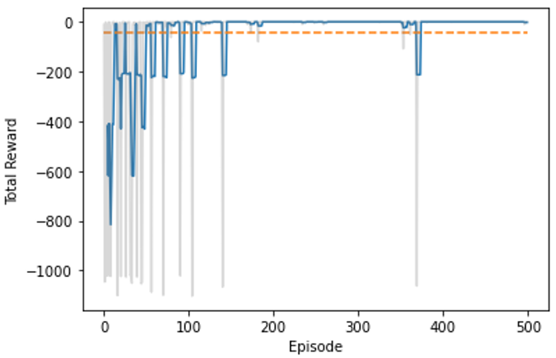

# AI 2021/2022 - Assignment 6
This folder contains the sixth assignment for the Artificial Intelligence course of the MSc. in Computational Data Science of the Free University of Bozen-Bolzano

This README contains only the explanation of the code structure for Task 3

## Team Members
Ceol Samuele, Fanti Coelho Lima Rachel, Hooshyar Hosna

## Table of Contents
[[_TOC_]]

## First setup
The first step required to run this assignment is to create the appropriate Conda environment.
To do so, open the command line, move to the source directory of this project (where the environment.yml file is contained) and run the command:

`conda env create --file environment.yml`

## Running the assignment (random world)
Once the environment has been created, activate it by running:

`conda activate aima2021`

Then, move to the wumpus-online folder (`cd gym`) where the code for this second assignment is contained.
The described examples can be found in the `run_custom_hunter.ipynb`.

## Tasks
You should apply the q-learning technique to the Wumpus problem using the Gym environment defined in [gym_wumpus](https://gitlab.inf.unibz.it/tessaris/wumpus/-/blob/69563f0bf2edcda46be9e30600149d225468551c/gym_wumpus/__init__.py) module. You should focus on the [wumpus-v0](https://gitlab.inf.unibz.it/tessaris/wumpus/-/blob/69563f0bf2edcda46be9e30600149d225468551c/gym_wumpus/__init__.py#L7) environment and compare the performance and differences of the RL-based agent with your online agent.
The challenges in the Wumpus problem lie in the fact that the perception will not provide enough details to describe an useful state (the Q-table is going to be too small and not enough discriminating), so you need to understand how to characterise an useful state for the learning algorithm.
To have a better understanding of the Wumpus gym environment you can look at the code in [gym-random-hunter.py](https://gitlab.inf.unibz.it/tessaris/wumpus/-/blob/69563f0bf2edcda46be9e30600149d225468551c/examples/gym-random-hunter.py), which implements a random player.
You should describe the technique you applied with its rationale and the results of your experiments.
You **must** implement a player class that uses the policy learned by your code. Obviously, the player is expected to play on the ### wumpus-v0
 environment. You can save and load the learned table using any Python serialisation class; e.g., if you use _Numpy_, [numpy.save](https://numpy.org/doc/stable/reference/generated/numpy.save.html).

## Code Structure
### GameEnvironment class

The game environment class is used to keep track of the episode variables required to construct a useful state representation. This object presents a similar (although stripped down) structure to what has been proposed for the previous assignments. 

This class contains the following variables:

* `START_LOC`: A tuple defining the start position of the agent. Its value is set to `(0,0)`.
* `agent_loc `: A tuple which stores the current position of the agent (x and y coordinate) . Initialised with the value of `START_LOC`.
* `agent_orientation` : A value of the enum `wumpus.Hunter.Orientation` which stores the direction that the agent is currently facing. Initialised with value `wumpus.Hunter.Orientation.N`.
* `wumpus_killed` : A Boolean variable indicating whether the Wumpus has already been killed. Initialised with value `False`.
* `gold_taken `: A Boolean variable indicating whether the gold has already been taken. Initialised with value `False`.
* `climbed_out `: A Boolean variable indicating whether the agent has already climbed out. Initialised with value `False`.
* `grab_reward` : A Boolean variable controlling whether a mid-game reward of `1000` points is granted upon successful collection of the gold.

The `GameEnvironment` methods are organised as follows:

* `execute_action()`: This method accepts as parameters the `action` that the agent has performed, the list of percepts the agent was sensing before executing the action (`old_obs`) and the new set of percepts the agent is currently sensing (`new_obs`) . Then:
	* It updates the `agent_loc` if a `wumpus.Hunter.Actions.MOVE` is performed and no `bump` is felt among the `new_obs`.
	* It updates the `agent_orientation` if a `wumpus.Hunter.Actions.LEFT` or `wumpus.Hunter.Actions.RIGHT` is performed.
	* It sets the `gold_taken` variable to `True` if a `wumpus.Hunter.Actions.GRAB` is performed and the `glitter` was felt among the `old_obs`. Additionally it returns a value of `1000` if the `grab_reward` variable was set to `True`.
	* It sets the `climbed_out` variable to `True` if a `wumpus.Hunter.Actions.CLIMB` is performed and the `agent_loc` corresponds to the `START_LOC`.
	* If among the `new_obs` a `scream` is registered, it sets the value of `wumpus_killed` to `True`.
* `reset_game()`: This method simply performs a call to the `__init__()` method of the `GameEnviroment` class in order to reset the class variables to their initial values.

### GymCustomPlayer class

This class contains the Q-Table and the necessary logic to populate it during training.

The `GymCustomPlayer` class makes use of the following enums:

* `ExplorationApproach`: It controls the way in which the exploration vs exploitation tradeoff is handled during training. This enum takes the following values:
	* `RANDOM`: At each step, the agent always takes a random action.
	* `GREEDY`: At each step, the agent always takes the best action according to the current Q-Table values.
	* `EPSILON_GREEDY`: The tradeoff is controlled by the value of the variable `epsilon` passed as parameter to the `train` method.
	* `DECAYING_EPSILON_GREEDY`: The tradeoff is controlled by the value of the variable `epsilon` passed as parameter to the `train` method. The value of `epsilon` decays at each episode in an exponential fashion according to the set value for `epsilon_decay`. The decay stops once `epsilon_min` is reached.
	* `EPSILON_JUMP`: The initial value of epsilon (`INITIAL_E`) is kept constant for a set percentage of episodes (`EPISODE_PERC`) and then set to `FINAL_E`. `EPISODE_PERC`, `INITIAL_E` and `FINAL_E` are all values of the namedtuple `epsilon_jump`.
* `BinaryStates`: A Q-Table state will always consider the location of the agent (x and y position) and its orientation. This enum controls which binary variables are also considered in a state. This enum takes the following values:
	* `BASIC`: Each state will also include the value for the `gold_taken` variable of the `GameEnvironment`  object.
	* `ADVANCED`: Each state will also include the value for the `gold_taken` and `wumpus_killed` variables of the `GameEnvironment`  object.
	* `COMPLETE`: Each state will also include the value for the `gold_taken`, `wumpus_killed` and `climbed_out` variables of the `GameEnvironment`  object.

This class contains the following variables:

* `MAX_ENV_SIZE`: Tuple defining the maximum game environment size that is considered for the state coordinates when initialising the Q-Table. Initialised with values `(8,8)`.
* `bin_states`: Value of the enum `BinaryStates` controlling which variables define a state in the current `GymCustomPlayer` object.
* `gym_Env`: Variable containing the Gym environment object currently in use.
* `q_table`: Numpy array containing the Q-Values. Initialised as a `numpy.zeroes()` made up of `gym_Env.action_space.n` columns and a number of rows corresponding to the total number of states that can be generated with the value currently set for `bin_states`. In this context, the number of columns is computed as follows `self.MAX_ENV_SIZE[0] * self.MAX_ENV_SIZE[1] * len(Hunter.Orientation) * (2 ** len(self.bin_states.value))`.
* `state_dict`: A dictionary containing a tuple representation of a state as key, and the corresponding Q-Table row index as value.
* `grab_reward`: Boolean variable determining whether a mid-game reward will be granted by the `GameEnvironment` object.
* `expl_approach`: Value of the enum `ExplorationApproach` controlling the exploration vs exploitation tradeoff.
* `epsilon_jump`: Value of the `EpsilonJump` namedtuple controlling the parameters for the `EPSILON_JUMP` exploration approach.

The `GameEnvironment` methods are organised as follows:

* `run_episode()`: Runs one episode in the specified game environment by selecting at each step the best action for a given state from the Q-table built during training.
* `train()`: Method used to update the values of the Q-Table by executing a set number of `episodes` in the currently set game environment. This method accepts as parameters values for the learning rate (`alpha`) and the discount factor for future rewards (`gamma`) and updates the Q-Values using the following 
formula:

	

	Additionally, this method accepts values for `epsilon`, `epsilon_min` and `epsilon_decay`  and controls the exploration vs exploitation tradeoff on the performed actions depending on the set value for `expl_approach`.
* `get_state_index()`: Given the current `GameEnvironment`, the method returns the Q-Table row index for the current state value.
* `print_q_table()`: This method prints the Q-Table as a `pandas.DataFrame` with named columns and rows.

## Test results
A number of tests have been performed using the described classes on three different  Wumpus game environments in order to try different combinations of state representations and exploration tradeoffs.

### Default world

This first `wumpus-v0` environment is a solvable game that does not require the agent to perform a kill in order to reach the gold. The default world looks as follows:

Given the simplicity of this environment, in order to train the agent it was sufficient to use the simplest state representation (`BinaryStates.BASIC`). The results  obtained using the `ExplorationApproach.DECAYING_EPSILON_GREEDY` with `epsilon=0.9`, `decay=0.01` and `epsilon_min=0.01` and the values of the `grab_reward` variable set to `False` and `True` respectively look as follows:

On the other hand, when using the `ExplorationApproach.EPSILON_JUMP` with `EPISODE_PERC = 0.8`, `INITIAL_E = 0.9` and `FINAL_E = 0.01` the following results have been obtained:
	

### World with mandatory kill

As a second test, a world requiring a mandatory Wumpus kill in order to reach the gold has been proposed. This world looks as follows:

In this context, the `BinaryStates.ADVANCED` state representation was required since knowing whether the Wumpus is alive or dead at a given point in the game will change the best course of action from a given location. Training the agent using the `ExplorationApproach.DECAYING_EPSILON_GREEDY` with `epsilon = 0.9`, `epsilon_decay = 0.0001` and `0.0005` respectively and `epsilon_min = 0.01`, the following results were obtained:

### Impossible world

Finally, a last test was performed on a world with no viable path to the gold:

In order to solve this kind of worlds, the `BinaryStates.COMPLETE` was introduced. In this context, having a representation of the `climbed_out` variable in the Q-Table allows for the  `START_LOC` states to converge in such a way as to have the Q-Values corresponding to the `wumpus.Hunter.Actions.CLIMB` action to be the most convenient choice. When trained with  `ExplorationApproach.DECAYING_EPSILON_GREEDY` with `epsilon = 0.9`, `epsilon_decay = 0.1` and `epsilon_min = 0.01`, the following results were gathered:

### Result table (with online agent data)

The following table illustrates the results obtained when calling the `run_episode()` method on the agents trained on the three different game environments. Additionally, the table also provides a direct result comparison with the online agent proposed in the previous graded assignment. In this context, the online player is executed with the default value of `truth_threshold = 0.8`.

|                    | Agent | Final reward | Nr. of steps |
|--------------------|-----------|------------------|------------------|
| Default        | RL        | 973              | 23               |
|                    | Online    | -54              | 53               |
| Mandatory kill | RL        | 979              | 12               |
|                    | Online    | 931              | 59               |
| No solution    | RL        | -1               | 1                |
|                    | Online    | -52              | 51               |

### Final considerations

Looking at the gathered results, it is noticeable how different world configurations might require different levels of granularity in the state representation in order to be correctly solved. In a general sense, it might make sense to always train the agent using the `BinaryStates.COMPLETE` representation which ensures convergence in all three scenarios (simple world, mandatory/advantageous kill and impossible game). Despite this fact, having a more complex state representation has an effect on the Q-Table size and, consequently, on the time required to reach convergence. In this context, if a new training is executed on the default world using the `BinaryStates.COMPLETE` representation (with `ExplorationApproach.EPSILON_JUMP`) and the training results are compared with the ones obtained using the `BinaryStates.BASIC` , the following is obtained:

This suggests that, when possible, using a simpler state representation is preferable.