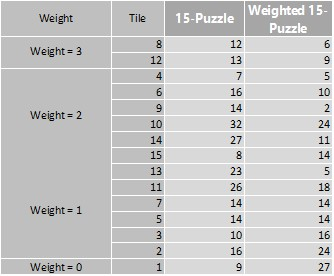
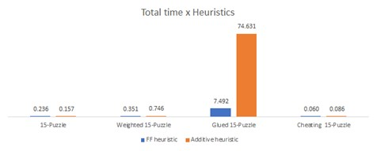
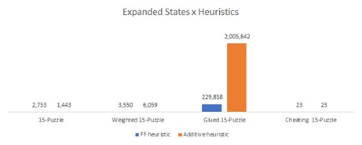
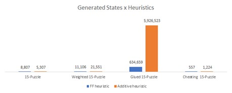

# AI 2021/2022 - Assignment 3

This folder contains the third assignment for the Artificial Intelligence course of the MSc. in Computational Data Science of the Free University of Bozen-Bolzano

## Team Members

Ceol Samuele, Fanti Coelho Lima Rachel, Hooshyar Hosna

## Table of Contents

[[_TOC_]]

## First setup

The first step required to run this assignment is to create the appropriate Conda environment.
To do so, open the command line, move to the source directory of this project (where the environment.yml file is contained) and run the command:

```conda env create --file environment.yml```

## Running the assignment

Once the environment has been created, activate it by running:

```conda activate aima2021```

## Exercise 1: Know the FD planner

### Exercise 1.a

Move to the planning folder (```cd aima2021-labs\planning\tile```) where the code for of this assignment is contained.

To run Fast Downward, use the command fast-downward with the corresponding domain and problem files, specifying the search algorithm and the heuristic:

```fast-downward puzzle.pddl puzzle01.pddl --heuristic "h=ff()" --search "eager_greedy([h])"```

Run Fast Downward on the 15-Puzzle and the Weighted 15-Puzzle, using greedy best first search and different heuristics:

- FF heuristic: ff()
- additive heuristic: add()
- blind heuristic: blind()

**Question:** How does the costs in weight01.pddl affect the solution?

**Answer:** The tiles with higher weights move less. The number of movements of each tile can be seen in the picture below.



### Exercise 1.b

**Puzzle**

FF heuristic

- Time: 0.109486s
- Expanded states: 2753
- Generated states: 8807

ADD heuristic

- Time: 0.0688985s
- Expanded states: 1443
- Generated states: 5307

BLIND heuristic

- Time: -
- Expanded states: -
- Generated states: -

**Weighted puzzle**

FF heuristic

- Time: 0.122047s
- Expanded states: 3550
- Generated states: 11106

ADD heuristic

- Time: 0.262928s
- Expanded states: 6059
- Generated states: 21551

BLIND heuristic

- Time: -
- Expanded states: -
- Generated states: -

### Exercise 1.c

**Glued 15-Puzzle**

In order to implement this version of the 15 tiles puzzle, the predicate ```(IS-GLUED ?x)``` has been added to set the status of a tile as "glued". Additionally, the precondition ```(not (IS-GLUED ?tile))``` has been added to the actions ```move-tile-down```, ```move-tile-up```, ```move-tile-right```, ```move-tile-left``` in order to avoid moving glued tiles. 

In the problem definition, a tile can be set as glued by adding ```(IS-GLUED tileNr)``` in the ```:init``` section.

The command to run the glued puzzle with _ff_ heuristic:

```fast-downward puzzle-glued.pddl puzzle-glued01.pddl --heuristic "h=ff()" --search "eager_greedy([h])"```

FF heuristic

- Time: 5.56927s
- Expanded states: 229858
- Generated states: 634659

ADD heuristic

- Time: 52.853s
- Expanded states: 2005642
- Generated states: 5926523

BLIND heuristic

- Time: -
- Expanded states: -
- Generated states: -

### Exercise 1.d

**Cheating 15-Puzzle**

In order to implement the cheating version of the 15 tiles puzzle, the actions ```remove-tile``` and ```reinsert-tile``` have been added.

The action ```remove-tile``` will check whether:

- The passed parameter for ```?tile``` actually represents a game tile. ```(IS-TILE ?tile)```.
- The passed tile is not already out of the board. ```(not (IS-OUT ?tile))```.
- The passed parameter for ```?row``` actually represents a game row. ```(IS-ROW ?row)```.
- The passed parameter for ```?column``` actually represents a game column. ```(IS-COLUMN ?col)```
- The called tile is actually found in the specified coordinates. ```(tile-at ?tile ?row ?col)```

If these preconditions are met, the action will:

- Remove the tile from the location. ```(not (tile-at ?tile ?row ?col))```.
- Set the location as blank. ```(is-blank ?row ?col)```.
- Set the tile status as "out". ```(IS-OUT ?tile)```.

In contrast, the action ```reinsert-tile``` will check whether:

- The passed parameter for ```?tile``` actually represents a game tile. ```(IS-TILE ?tile)```.
- The passed tile is out of the board. ```(IS-OUT ?tile)```.
- The passed parameter for ```?row``` actually represents a game row. ```(IS-ROW ?row)```.
- The passed parameter for ```?column``` actually represents a game column. ```(IS-COLUMN ?col)```
- The chosen location is blank. ```(is-blank ?row ?col)```

If these preconditions are met, the action will:

- Place the tile in the location. ```(tile-at ?tile ?row ?col)```.
- Set the location as not blank. ```(not (is-blank ?row ?col))```.
- Set the tile status as not "out". ```(not (IS-OUT ?tile))```.

The command to run the cheat puzzle with _ff_ heuristic:

```fast-downward puzzle-cheat.pddl puzzle-cheat01.pddl --heuristic "h=ff()" --search "eager_greedy([h])"```

FF heuristic

- Time: 0.01305s
- Expanded states: 23
- Generated states: 557

ADD heuristic

- Time: 0.0257662s
- Expanded states: 23
- Generated states: 1224

BLIND heuristic

- Time: -
- Expanded states: -
- Generated states: -

### Comparision

    
    


## Exercise 2: Vampire domain

### Exercise 2.a

In order to implement the vampire game, the actions ```toggle-light``` and ```watch-fight``` were implemented.

The action ```remove-tile``` will check whether:

- The passed parameter for ```?room``` and ```?anti-clockwise-neighbor``` are actually adjacent. ```(NEXT-ROOM ?anti-clockwise-neighbor ?room)```.
- The passed parameter for ```?room``` and ```?clockwise-neighbor``` are actually adjacent. ```(NEXT-ROOM ?room ?clockwise-neighbor)```.
- Agent and Slayer are not currently fighting. ```(not(fighting))```.

If these preconditions are met, additional checks are performed to determine which actions needs to be executed:

1. If the light in the selected room is currently switched off. ```(not(light-on ?room))```:
     - The light will be switched on. ```(light-on ?room)```
2. If the light in the selected room is currently switched on. ```(light-on ?room)```:
     - The light will be switched off. ```(not (light-on ?room))```
3. **Vampire**: 
    
    If all the following conditions are true:
    - The vampire is currently alive. ```(vampire-is-alive)```.
    - The vampire is in the selected room ```(vampire-is-in ?room)```.
    - The light will be switched on (meaning it is currently off). ```(not(light-on ?room))```.
    - There is no light in the anti clockwise neighbor. ```(not(light-on ?anti-clockwise-neighbor))```.
     
    Then:
    - The vampire is removed for the current room. ```(not(vampire-is-in ?room))```.
    - The vampire is **moved to the anti clockwise neighbor**. ```(vampire-is-in ?anti-clockwise-neighbor)```.
4. **Vampire**: 

    If all the following conditions are true:
    - The vampire is currently alive. ```(vampire-is-alive)```.
    - The vampire is in the selected room ```(vampire-is-in ?room)```.
    - The light will be switched on (meaning it is currently off). ```(not(light-on ?room))```.
    - The light is on in the anti clockwise neighbor. ```(light-on ?anti-clockwise-neighbor)```.
     
    Then:
    - The vampire is removed for the current room. ```(not(vampire-is-in ?room))```.
    - The vampire is **moved to the clockwise neighbor**. ```(vampire-is-in ?clockwise-neighbor)```.
5. **Slayer**: 

    If all the following conditions are true:
    - The slayer is currently alive. ```(slayer-is-alive)```.
    - The slayer is in the selected room ```(slayer-is-in ?room)```.
    - The light will be switched off (meaning it is currently on). ```(light-on ?room)```.
    - The light is not on in the anti clockwise neighbor. ```(not (light-on ?clockwise-neighbor))```.
     
    Then:
    - The slayer is removed for the current room. ```(not(slayer-is-in ?room))```.
    - The slayer is **moved to the anti clockwise neighbor**. ```(slayer-is-in ?anti-clockwise-neighbor)```.
6. **Slayer**: 

    If all the following conditions are true:
    - The slayer is currently alive. ```(slayer-is-alive)```.
    - The slayer is in the selected room ```(slayer-is-in ?room)```.
    - The light will be switched off (meaning it is currently on). ```(light-on ?room)```.
    - The light is on in the clockwise neighbor. ```(light-on ?clockwise-neighbor)```.
     
    Then:
    - The slayer is removed for the current room. ```(not(slayer-is-in ?room))```.
    - The slayer is **moved to the clockwise neighbor**. ```(slayer-is-in ?clockwise-neighbor)```.

Additionally, in ```3, 4, 5``` &  ```6``` the system will also check whether:

- The adversary (either vampire or slayer depending on who is being moved) is alive. ```(adversary-is-alive)```, where ```adversary``` is either ```vampire``` or ```slayer```
- The adversary is in the target location (either clockwise or anti clockwise neighbor). ```(adversary-is-in ?target-neighbor)```, where ```adversary``` is either ```vampire``` or ```slayer``` and ```target``` is either ```clockwise``` or ```anti-clockwise```

If these preconditions are met, then:

- Slayer and vampire need to fight. ```(fighting)```

The action ```watch-fight``` will check whether:

- Both vampire and slayer are in the room passed as parameter. ```(slayer-is-in ?room)``` and ```(vampire-is-in ?room)```
- Both vampire and slayer are alive. ```(slayer-is-alive)``` and ```(vampire-is-alive)```
- The two need to fight. ```(fighting)```

If these preconditions are met, additional checks are performed to determine who wins:

1. **Vampire wins**: 
    
    If all the following conditions are true:
    - The light in the room is turned off. ```(not(light-on ?room))```
    - The room does not contain garlic. ```(not(CONTAINS-GARLIC ?room))```

    Then:
    - The slayer is declared dead. ```(not(slayer-is-alive))```
    - The two are not fighting any longer. ```(not(fighting))```

2. **Slayer wins**: 
    
    If one of the following conditions is true:
    - The light in the room is turned on. ```(light-on ?room)```
    - The room contains garlic. ```(CONTAINS-GARLIC ?room)```

    Then:
    - The vampire is declared dead. ```(not(vampire-is-alive))```
    - The two are not fighting any longer. ```(not(fighting))```

To run this algorithm for _ff_ heuristic, we need to be in _vampire_ folder and run the following command:

```fast-downward domain.pddl p01.pddl --heuristic "h=blind()" --search "eager_greedy([h])"```

There are ten separate configurations for the game, from p01.pddl to p10.pddl. They are different in the number of rooms, which rooms have the light on, the position of garlic, vampire, and slayer and the goal.

## Exercise 3: Hunt the Wumpus

To implement this exercise, the solution nr 3 from "[Modelling the Wumpus World in PDDL](http://users.cecs.anu.edu.au/~patrik/pddlman/wumpus.html)" has been proposed. As suggested in the "Sum of Action Costs" section of "[Writing Planning Domains and Problems in PDDL](https://users.cecs.anu.edu.au/~patrik/pddlman/writing.html)", the function ```(:functions(total-cost) - number)``` and the action effect ```(increase (total-cost) n)``` (where "n" is the action cost) have been added to the domain specification. Additionally, the initialization of the path cost ```(= (total-cost) 0)``` and the minimization metric ```(:metric minimize (total-cost))``` have been added to the problem definition. It is also worth mentioning that the action ```move-wumpus``` has been removed from the domain specification since it did not match the previously discussed constraints imposed by the game rules.

### Exercise 3.b

The ```.world_builder()``` function in the _build_world.ipynb_ notebook accepts a JSON variable containing the details of the game environment (as described in Assignment 2) and generates the corresponding _.pddl_ file. The details of the ```.world_builder()``` function won't be discussed in detail in this readme. It is sufficient to say that the function dynamically builds a string variable (```res```) depending on the current world parameters and the expected structure of the _.pddl_ file. It is however important to note how the _id_ value in the input json variable will determine the name of the output file.

### Exercise 3.c

It has been decided to run the wumpus game on the same set of seven static worlds used in Assignment 2.

To run this algorithm for _ff_ heuristic, we need to be in _wumpus_ folder and run the below code:

```fast-downward wumpus.pddl w01.pddl --heuristic "h=ff()" --search "eager_greedy([h])"```

**Note**: The following results are obtained by running instances of greedy best first on the wumpus environment. For optimal results algorithms such as A-Star can be used instead. To run an instance of the wumpus game using A-Star use the following command:

```fast-downward wumpus.pddl w01.pddl --heuristic "h=ff()" --search "astar(h)"```

**Results**:

**Blind**

|         | **Time**      | **Plan length** | **Plan cost** | **Generated states** | **Expanded states** |
|---------|---------------|-----------------|---------------|----------------------|---------------------|
| **W01** | 0.00086842s   | 21              | 21            | 1593                 | 348                 |
| **W02** | 0.000977804s  | 21              | 21            | 2167                 | 508                 |
| **W03** | 0.000581064s  | 22              | 31            | 1726                 | 393                 |
| **W04** | 0.000982829s  | 22              | 31            | 2266                 | 495                 |
| **W05** | 0.000281358s  | 12              | 21            | 669                  | 159                 |
| **W06** | 0.000446134s  | 14              | 23            | 1087                 | 248                 |

**FF**

|         | **Time**     | **Plan length** | **Plan cost** | **Generated states** | **Expanded states** |
|---------|--------------|-----------------|---------------|----------------------|---------------------|
| **W01** | 0.000604948s | 21              | 21            | 214                  | 47                  |
| **W02** | 0.000453109s | 21              | 21            | 109                  | 28                  |
| **W03** | 0.000858273s | 22              | 31            | 175                  | 41                  |
| **W04** | 0.000663104s | 22              | 31            | 110                  | 25                  |
| **W05** | 0.000370963s | 23              | 23            | 99                   | 26                  |
| **W06** | 0.000492135s | 21              | 21            | 91                   | 24                  |

**Add**

|         | **Time**     | **Plan length** | **Plan cost** | **Generated states** | **Expanded states** |
|---------|--------------|-----------------|---------------|----------------------|---------------------|
| **W01** | 0.000720439s | 21              | 21            | 214                  | 47                  |
| **W02** | 0.000554424s | 21              | 21            | 109                  | 28                  |
| **W03** | 0.000728624s | 22              | 31            | 105                  | 26                  |
| **W04** | 0.00075153s  | 22              | 31            | 101                  | 23                  |
| **W05** | 0.000591168s | 23              | 23            | 99                   | 26                  |
| **W06** | 0.000565405s | 21              | 21            | 91                   | 24                  |