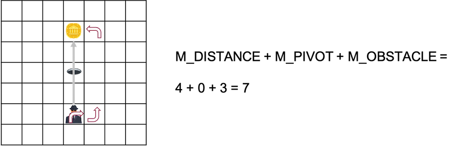

# AI 2021/2022 - Assignment 2

This folder contains the second assignment for the Artificial Intelligence course of the MSc. in Computational Data Science of the Free University of Bozen-Bolzano

## Team Members

Ceol Samuele, Fanti Coelho Lima Rachel, Hooshyar Hosna

## Table of Contents

[[_TOC_]]

## First setup

The first step required to run this assignment is to create the appropiate Conda environment.
To do so, open the command line, move to the source directory of this project (where the environment.yml file is contained) and run the command:

```conda env create --file environment.yml```

## Running the assignment (random world)

Once the environment has been created, activate it by running:

```conda activate aima2021```

Then, move to the wumpus-offline folder (```cd wumpus-offline```) where the code for this second assignment is contained.

Executing the provided pathfinding algorithms on a random world is a simple matter of adapting the following command:

```gridrunner --world WumpusWorld --entry hunter_AStar:AStarPlayer --horizon HORIZON```

In order to change the explored horizon, simply change ```HORIZON``` to an integer value of choice.

An example of a complete working command for a random world looks as follows:

```gridrunner --world WumpusWorld --entry hunter_AStar:AStarPlayer --horizon 500```

Note that running the A-Star algorithm will prompt the user to select an heuristic of choice before trying to solve the problem at hand. Choosing ```NONE``` will execute an instance of Uniform Cost Search.

## Running the assignment (static world)

In order to measure the differences in algorithm performance brought upon by the different optimization strategies implemented during the course of this assignment in a more consistent manner, a series of static worlds has been created.

In order to execute the provided pathfinding algorithms in these static scenarios, the user can simply execute the python code contained into the Jupyter notebook named ```run_AStar.ipynb```.

## Task description

As in the previous assignment, your task is to implement a player that perform an offline search for a sequence of moves to solve the game and then simply execute them when asked via the ```play``` method.

Your code must be runnable via the ```gridrunner``` script which takes as input the reference to the class implementing the player. By default the script adds the current directory to the Python search path ([sys.path](https://docs.python.org/3/library/sys.html#sys.path)) but an alternative path could be added with the ```--path``` option. For example the player in [examples/wumpus_usage.py](https://gitlab.inf.unibz.it/tessaris/wumpus/-/blob/master/examples/wumpus_usage.py) could be run using:

```gridrunner --world WumpusWorld --entry wumpus_usage:GooPlayer```

### Implement the search for the Wumpus

Your task is to create a player (a subclass of ```wumpus.OfflinePlayer```) able to control the hunter in such a way that it maximise its outcome. The size and layout of the world will be randomly generated but your player will have access to the world and agent instances (see ```GooPlayer``` in ```wumpus_usage.py``` for details on how to use them). You can make the following assumptions, following the classic game setup:

- the environment is a square
- there is exactly a wumpus
- there is exactly a gold ingot
- the environment doesn't contain any block
- the hunter is always starting in the bottom left corner facing upward (north)
- there is a single exit placed in the same square where the hunter starts

Note that it's not guaranteed that the gold ingot is always reachable; that is there might be cases in which the gold ingot is not reachable and the strategy to maximise the outcome is to climb out immediately.

### Actions

The actions of the agent, so those that your player should return, can be accessed via the ```wumpus.Hunter.Actions``` class and correspond to the one described in the [game](https://ole.unibz.it/mod/page/view.php?id=133939):

```
wumpus.Hunter.Actions = class Actions(wumpus.gridworld.Actions)
 |  An enumeration.
 |  
 |  Method resolution order:
 |      Actions
 |      wumpus.gridworld.Actions
 |      enum.Enum
 |      builtins.object
 |  
 |  Data and other attributes defined here:
 |  
 |  CLIMB = <Actions.CLIMB: 5>
 |  GRAB = <Actions.GRAB: 4>
 |  LEFT = <Actions.LEFT: 2>
 |  MOVE = <Actions.MOVE: 0>
 |  RIGHT = <Actions.RIGHT: 1>
 |  SHOOT = <Actions.SHOOT: 3>
 ```

## Code structure

In order to complete this second assignment, it has been decided to maintain the same class/method structure found in Assignment 1. This choice is justified by the many similarities the two games share. The following subsections will describe the structure of the implemented pathfinding algorithm and of the game environment class respectively.

### Structure of the pathfinding algorithm

Just like in the first assignment, the custom implementation of the (A-Star) pathfinding algorithm is executed from within the Python file containing the extension of the ```OfflinePlayer``` class. In this case, the extension of said class is contained in the file is named ```hunter_AStar.py``` and it contains two methods. 

Upon execution, the ```.start_episode()``` method prompts the user to choose an heuristic for the current game, storing the choice in the ```chosen_heuristic``` variable. Secondly, a new ```GameEnvironment``` object (which is used to simulate the game environment) is initialized. The details of such an object are described in the next subsection. Finally, the pathfinding algorithm is executed by calling the ```.AStar()``` method, which takes as input the previously initialized game environment.

As previously mentioned, the proposed solution shares many similarities to what has been proposed in Assignment 1, which contained a relatively straightforward implementation of A-Star to begin with. Because of this reason, this subsection will only contain the main points of difference to what has been previously proposed:

- The currently proposed solution tries to address the issue of ties (i.e. paths having the same cost) by further refining how partial solutions are stored in the priority queue. Previously, there was no precise way in which paths having the same total cost where organized within the priority queue. In this new implementation, paths are first sorted by cost and then further organized by heuristic value. This means that, given the same path + heuristic cost, paths having smaller heuristic values will appear first in the queue and therefore will be prioritized by the pathfinding algorithm. From [StackOverflow](https://stackoverflow.com/questions/50519502/a-star-algorithm-using-heuristic-value-to-act-as-tie-breaker-where-nodes-have-i), the reason behind this choice can be summarized as follows: "By implementing the tie-breaker you propose, you are essentially saying: whenever two nodes have the same value for F = G + H, I prefer those with greater G and smaller H over those with smaller G and greater H. This is wise because, when the more reliable G component of F dominates the less reliable H component, F itself will also be more reliable." 
- Even though the movement rules are slightly different when compared to the ones provided in the first assignment, the pathfinding algorithm still reasons in terms of cardinal direction (N, E, S, W). This means that all the logic related to pivoting the agent (in an optimal way) is handled from within the ```GameEnvironment``` object. The pathfinding algorithm limits itself to requesting to the game environment which directions are free (```game_env.get_viable_directions()```) and executes them (```game_env.execute_direction()```) in order to extend the currently examined priority queue item. In this context, executing a direction will entail 0 or more pivoting actions and one move action. This choice increases readability of the pathfinding related code by hiding some game details in the ```GameEnvironment``` class.
- When returning a solution, an additional check is performed to verify if the found path is more expensive than just climbing out of the game environment (this happens when more than a 1000 steps are needed to reach the gold and go back to the start location). In this case, the found solution is discarded and the agent is instructed to climb out of the game environment. Furthermore, if the ```.get_heuristic()``` method return a value of ```-1``` (signaling an impossible game), the search is interrupted and the agent instructed to immediately climb out of the cave.

### Structure of the game environment class

As previously mentioned, the ```GameEnvironment``` class is used to simulate the state of a given world environment. This class can be found in the ```game_env.py``` file.

In order to be initialized, the class accepts the following set of variables:
- ```world_size```. A tuple controlling the size of the world in terms of width and height.
- ```gold_loc```. A tuple containing the x and y coordinates related to the gold location.
- ```wumpus_loc```, A tuple containing the x and y coordinates related to the Wumpus location.
- ```pit_locs```, A list of tuples containing the x and y coordinates related to the pit locations.
- ```heuristic```, A value of the enum ```HeuristicApproach``` indicating what kind of heuristic (or optimization technique) is being used in the current environment. Default value is ```HeuristicApproach.NONE```

Additionally, another set of variables is initialized within the ```.__init__()``` method upon instantiating a ```GameEnvironment``` object. Namely:
- ```agent_loc```. A tuple containing the x and y coordinates related to the agent location. Initialized with the value of the class variable ```START_LOC```, which corresponds to the tuple ```(0, 0)```.
- ```agent_orientation``` = A value belonging to the enum ```wumpus.Hunter.Orientation``` indicating the facing direction of the agent. Initialized with enum value ```Hunter.Orientation.N```.
- ```taken_gold``` = A boolean variable indicating wether the agent has grabbed the gold. Initialized with value ```False```.
- ```killed_wumpus``` = A boolean variable indicating wether the agent has killed the Wumpus. Initialized with value ```False```.
- ```climbed_out``` = A boolean variable indicating wether the agent has climbed out of the cave. Initialized with value ```False```.
- ```agent_path``` = A list of tuples containing the location visited by the current agent path. Initialized as an empty list.
- ```path_cost``` = An integer value indicating the current cost of the path. Initialized as ```0```.
- ```game_status``` = Value of the enum ```GameStatus``` indicating wether the game is running or not. Initialized with enum value ```GameStatus.RUNNING```.
- ```mandatory_shoot``` = A boolean variable indicating wether shooting the Wumpus is mandatory in the current configuration (Related to heuristic ```FLOOD_FILL```). Initialized with value ```False```.
- ```impossible_game``` = A boolean variable indicating wether the game is not solvable in the current configuration (Related to heuristic ```FLOOD_FILL```). Initialized with value ```False```.

As mentioned, the ```game_env.py``` file also contains a set of enums and class variables that are used by the ```GameEnvironment``` class. These are:
- Enum ```GameStatus```. Takes values ```GameStatus.RUNNING``` and ```GameStatus.OVER``` and indicates wether a game is running or not (i.e. the current path is a solution).
- Enum ```HeuristicApproach```. Takes values ```HeuristicApproach.NONE```, ```HeuristicApproach.MANHATTAN_SIMPLE```, ```HeuristicApproach.MANHATTAN_PIVOTS```, ```HeuristicApproach.MANHATTAN_OBSTACLE```, ```HeuristicApproach.MANHATTAN_ITERATIVE_SHIFT```, ```HeuristicApproach.FLOOD_FILL```, ```HeuristicApproach.AREA_PRUNING``` and indicates the currently chosen heuristic.
- Enum ```ManhattanShape```. Takes values ```ManhattanShape.STRAIGHT``` and ```ManhattanShape.ELBOW``` and is used to indicate the shape of a given manhattan path (used in the context of ```HeuristicApproach.MANHATTAN_ITERATIVE_SHIFT```).
- Variable ```START_LOC```. Indicates the starting location of the agent and corresponds to the tuple ```(0, 0)```.
- Variable ```WIN_COST```. Indicates the cost (negative reward) of climbing out of the cave with the gold. Corresponds to the value ```-1000```.
- Variable ```ACTION_COST```. A dictionary with keys ```Hunter.Actions.MOVE```, ```Hunter.Actions.RIGHT```, ```Hunter.Actions.LEFT```, ```Hunter.Actions.SHOOT```, ```Hunter.Actions.GRAB```, ```Hunter.Actions.CLIMB``` and values 1, 1, 1, 10, 1, 1 respectively. It contains the available moves, together with their cost.

In terms of methods, the logic behind the ```GameEnvironment``` class is organized as follows:
- ```.get_viable_direction()```. As previously mention, the implemented pathfinding algorithm still reasons in terms of cardinal directions. Because of this reason, given the current location of the agent, this method will return the (sub)set of directions that are not blocked by the environment boundaries, pits or wumpus items. Additionally, the method will check if the Wumpus is killable from the current location (i.e. it shares either the x or y axis with the agent). If that is the case, ```Hunter.Actions.SHOOT``` will also be returned as a possible alternative. Additionally, it is possible to call this method for any arbitrary location on the game environment (not necessarily the agent location) by setting the parameter ```start_loc```. It is also possible to block the method from returning the shooting action as a possible result by changing the parameter ```consider_shoot``` to ```False```. Finally, it is possible to force the method to consider the Wumpus location as a walkable tile by setting the parameter ```consider_wumpus``` to ```False```.
- ```.execute_direction()```. In order to execute one of the available cardinal directions, the pathfinding algorithm will call the method ```.execute_direction()```. This methods calculates the appropriate pivots required for the agent to face the target direction, and will call one instance of the ```.execute_action()``` for each pivot (left or right) and move action required to reach the current target direction. Note that this method always computes the optimal pivots required for the agent to face a given direction (Example: If the agent is facing N and the target direction is E, the path will execute one right pivot instead of three left ones).
- ```.execute_action()```. As anticipated, this method executes a single action (```wumpus.Hunter.Actions```) which is passed as parameter. Executing an action means: updating the ```agent_loc```, appending the action to the ```agent_path```, adding the cost of the action to the ```path_cost``` and checking the game status (using the ```.check_game_status()``` method). Additionally, a recursive call to the ```.execute_action()``` method will be executed when: 
  - After a move (```Hunter.Actions.MOVE```) the agent is in the gold location (```agent_loc == gold_loc```) and the gold is yet to be taken (```taken_gold``` is ```False```). In this case, a grab (```Hunter.Actions.GRAB```) is immediately executed.
  - After a move (```Hunter.Actions.MOVE```) the agent is in the start location (```agent_loc == START_LOC```) and the gold has already been taken (```taken_gold``` is ```True```). In this case, a climb (```Hunter.Actions.CLIMB```) is immediately executed.
- ```.check_game_status()```. This method will check (and return) the current game status and update the ```game_status``` variable accordingly. In this context, if the agent has already climbed out (variable ```climbed_out``` is ```True```) the game status is set as over.
- ```reset_game()```. Resets the game to the initial configuration. This means resetting the ```agent_loc```, ```agent_orientation```, ```taken_gold```, ```killed_wumpus```, ```climbed_out```, ```agent_path```, ```path_cost``` and ```game_status``` variables to the initial value.
- ```.load_path()```. Given a path (in the form of a list containing a set of actions), this method will reset the current game and execute the set of actions contained in the path list.

Additionally, the ```GameEnvironment``` class contains a set of methods that relate directly to the implemented heuristics and optimization techniques. The methods are mentioned in the following list, but it must be noted that details regarding the logic governing said techniques is explained in details in the next section:
- ```get_heuristic()```. This is the method called by the pathfinding algorithm in order to get integer value related with the heuristic of choice from the node in which the agent is located.
- ```.compute_manhattan_simple()```. Method that relates to the ```HeuristicApproach.MANHATTAN_SIMPLE```, explained in the next section.
- ```.compute_manhattan_pivots()```. Method that relates to the ```HeuristicApproach.MANHATTAN_PIVOTS```, explained in the next section.
- ```.compute_manhattan_obstacle()```. Method that relates to the ```HeuristicApproach.MANHATTAN_OBSTACLE```, explained in the next section.
- ```.compute_relative_dir()```. Given an origin and a target location, this method will return a list containing the cardinal directions of the target location with regards to the origin ones. Possible results are: ```[N], [N,E], [E], [S,E], [S], [S, W], [W], [N, W] ```
- ```.compute_manhattan_paths()```. Given an origin and a target location, it returns a list containing the (set of) manhattan path(s) that connect the two locations. If the relative direction of the target with regards to the origin is a cardinal location, then a single path is returned (straight manhattan path). Otherwise, two (elbow shaped paths) are returned.
- ```.attempt_path_shift()```. Method that relates to the ```HeuristicApproach.MANHATTAN_ITERATIVE_SHIFT```, explained in the next section.
- ```.check_contacting_pits()```. Method that relates to the ```HeuristicApproach.MANHATTAN_ITERATIVE_SHIFT```, explained in the next section.
- ```.flood_fill()```. Method that executes a flood filling algorithms from a given location. It returns the set of locations that have been filled during the flooding and the set of border locations that have stopped it. Setting the parameter ```consider_wumpus``` to ```False``` will avoid having the Wumpus stopping the flooding process.
- ```.perform_area_pruning()```. Method that relates to the ```HeuristicApproach.AREA_PRUNING```, explained in the next section.

## Heuristics & optimization strategies

The main focus during the development of this assignment has centered around the development of a set of heuristics and optimization strategies implemented with the purpose of improving the performance (mainly in terms of nr of explored nodes) of the provided implementation of the A-Star algorithm.

Just like in the first assignment, each execution of A-Star will prompt the user to choose a given heuristic. In this regard, it is important to notice how when choosing a heuristic from the provided list, the chosen heuristic AND all the previous ones in the list will be computed. This means, for example, that choosing 
the heuristic related to the nr of pivots in the manhattan path (```MANHATTAN_PIVOTS```) will also consider the one related to the manhattan distance (```MANHATTAN_SIMPLE```).
In this case, the final results for a given node will be determined by: The Manhattan distance from the agent to goal location + the minimum number of pivots required to cover this Manhattan path.

The heuristic in this assignment are designed to provide admissible results (i.e. not to overestimate the true cost of the path) even when executed in this stacked fashion.

### Defining the goal state

Looking at the rules governing the Wumpus game, it is easy to see how the final goal of the game (getting to the gold, grabbing it & leaving the cave from the start location) can be broken down into two sub-goals:

1. Getting from the agent location to the gold location if the gold has not yet been taken. In this case, the goal state corresponds to the location of the gold in the grid.
2. Getting back to the start location if the gold has already been taken. In this case, the goal state corresponds to the start location.

At any given point during the game, the heuristics will need to account for either both objectives or only the second one depending on the current status of the game. More precisely:

1. If the gold is still on the grid, the heuristic function will need to compute a first estimate corresponding to the path cost between the agent and the gold. This first estimate will then be added to a second estimate related to the path cost between the gold and the start location.

   

2. If the gold has already been taken, the heuristic function will simply return an estimate corresponding to the expected path cost between the agent and the start location.

   

At this point, it might also be useful to underline that all heuristics take into account some fixed costs corresponding to actions that the agent will surely need to execute on a given path. Namely:

- If the gold is still on the grid (variable ```taken_gold``` is False), the cost for the action ```Hunter.Actions.GRAB``` is added to the heuristic.
- If the agent has yet to climb out of the cave (variable ```climbed_out``` is False), the cost for the action ```Hunter.Actions.CLIMB``` is added to the heuristic.
- If Wumpus and gold are located on the same tile, the kill is mandatory and the cost for the action ```Hunter.Actions.SHOOT``` is added to the heuristic.

### No heuristic (NONE)

Choosing this heuristic will simply make the ```.get_heuristic()``` method return a value of ```0``` for all nodes. Having this entry is useful to execute an instance of the Uniform Cost Search algorithm.

### Manhattan distance (MANHATTAN_SIMPLE)

This first heuristic simply computes the manhattan distance between two locations. The computation of such a distance is handled by the ```.compute_manhattan_simple()``` method. The method accepts an origin and target location and computes their manhattan distance using the ```.cityblock()``` function provided by the ```distance``` package of the ```scipy.spatial``` library.

Additionally, the method will check if the provided target location corresponds to the gold location (variable ```gold_loc```). If that is the case, a recursive call is executed to add to the agent-gold distance the value of the gold-start distance.

### Pivots for the Manhattan path (MANHATTAN_PIVOTS)

This second heuristic computes the MINIMUM number of (left or right) pivots required to move from an origin to a target location. Given an origin and target location, the computation of this heuristic (which is handled from within the ```.compute_manhattan_pivots()``` method) is performed by decomposing the problem into two main steps.

Firstly, the agent (that has a given starting orientation) before initiating his movement will have to perform a set of turning actions in order to face the correct direction with regards to his target. In order to determine this minimum number of (pre-movement) pivoting motions, it is necessary to first compute the cardinal direction of the target location with regards to the origin.

In order to do so, the method ```.compute_relative_dir()``` has been implemented. This method (which accepts an origin and a target location) returns a list representing one of the eight possible cardinal directions we might encounter during the game when analyzing the relative position of a target location with regards to an origin one (```[N], [N,E], [E], [S,E], [S], [S, W], [W], [N, W]```).

Starting from this information, it is possible to determine that the minimum number of pivoting motions an agent has to perform in order to face the correct travel direction always falls into one of three possible cases:

1. If the orientation of the agent appears in the cardinal direction he has to travel to, the minimum number of pivots is equal to ```0```. 
   Example: If the agent is facing N, no pivots are required to go N, NW & NE
2. If the cardinal direction the agent has to travel to contains an adjacent direction (N to E, E to W, etc...) to the one he is currently facing, the minimum number of pivots is equal to ```1```.
   Example: If the agent is facing N, only one pivot is required to go W, SW, E, SE
3. If the cardinal direction the agent has to travel to is the exact opposite of the one he is currently facing, the minimum number of pivots is equal to ```2```
   Example: If the agent is facing N, two pivots are required to go S

   

Once the minimum number of pivots required in order to face the correct travel direction has been determined, it is necessary to compute the number of turning actions that will be executed once the agent will start to move. When working with manhattan paths, computing this value is a very straightforward process given that this kind of paths always fall into one of two categories:

1. Straight manhattan path. This kind of path appears when the target location shares the same x or y coordinate with the origin location. A straight manhattan path requires ```0``` pivots.
2. All other manhattan paths are elbow shaped (origin and target location have different x and y coordinate values). An elbow shaped manhattan path requires ```1``` pivot.

As stated at the beginning of this section. The methods that deal with computing the heuristic values need to be called a second time when the initial target location corresponds to the gold location (i.e. the gold has yet to be taken). The second call for the ```.compute_manhattan_pivots()``` method needs to accurately compute the minimum number of pivots required to travel from the gold location to the start location.
This creates an interesting scenario because when the cardinal direction of the gold with regards to the agent is an intercardinal one (```[N,E], [S,E], [S, W], [N, W]```), there will always be two possible (elbow shaped) manhattan paths that will lead the agent to its target location. In this context, two different paths also correspond to two possible orientations the agent will be facing once it arrives to his destination.

In order to deal with this fact, the parameter ```origin_orientation``` (denoting the initial orientation of the agent) for the second call to ```.compute_manhattan_pivots()``` contains both the possible orientation the agent could have once the target is reached. In this context, the minimum number of pivots required to go to any direction will always be either ```0``` or ```1```.

Example: Supposing that the agent needs to travel NE in order to reach the gold, the possible orientations he will face once the target has been reached will be either N (if the agent has taken the right-top path) or E (if the agent has taken the top-right path). Considering both this arrival orientations, the minimum number of pivots required to travel NW, N, NE, E, SE in the second call is ```0```, while the number of pivots required to travel S, SW, W is ```1```.

### Obstacles in the Manhattan path (MANHATTAN_OBSTACLE)

For this third heuristic the algorithm will try to consider the presence of obstacles on the available manhattan paths to a target location. In particular, a given manhattan path will either be classified as free (if no pits appear on it) or as occupied (if at least one pit appears on it). In order to compute the locations that are covered by a given path, the method ```.compute_manhattan_paths()``` has been developed.
This method will accept an origin and target location and will return the list of possible manhattan paths that can connect the two (either one path if there is a straight line connecting the two locations or two paths if they are elbow shaped). 

Once the path between two location has been computed, it is possible to calculate the minimum number of extra pivots an obstacle would impose on the agent if it appeared on at least one of the locations covered by it. This is computed differently depending on the type of path that is being evaluated:

- For an individual straight path where the agent is facing the target, it is easy to realize how the presence of a pit would require the addition of ```3``` extra pivots. Note that the extra moves required for the detour imposed by the pit are computed in the ```MANHATTAN_ITERATIVE_SHIFT``` heuristic. An example of such a situation looks as follows:

   

   When dealing with a straight path, the agent could be facing away from the gold. In this case, only ```1``` extra pivot is added to the heuristic. The justification for this choice might not be immediately apparent, and can be explained as follows: Knowing that the result of a given heuristic is built on top of the previous ones, it is possible to determine that the execution of ```MANHATTAN_OBSTACLE``` will need to take into account the effect of ```MANHATTAN_PIVOTS``` when incrementing the heuristic value. It has been described how ```MANHATTAN_PIVOTS``` will add the ```0```, ```1``` or ```2``` pivots required for the agent to face the target direction. This however does not take into account possible pits that could be present in the optimal path related to the direction the agent is going to face (since they are taken into consideration only when ```MANHATTAN_OBSTACLE``` is executed). If, for instance, the agent is facing S and the relative direction of the gold with regards to the agent is N, ```MANHATTAN_PIVOTS``` will determine that the agent needs to be pivoted two times in order to face the correct direction (therefore adding a ```+2``` to the heuristic value). However, if afterwards ```MANHATTAN_OBSTACLE``` is also executed, the system will quickly realize that the the originally planned path is not feasible due to the encountered pit. In this case, it is still desirable to keep the ```2``` previously added pivots. Originally, they represented two pivots to execute on the agent to face the correct direction (N). Now, they represent one agent pivot (S to E or S to W) and one path pivot. It is now obvious how adding an additional (```+1```) pivot will account for all the required pivoting motion. Note that the same is true if, for example, the agent is originally facing E or W for a gold ingot located N. In this case, ```MANHATTAN_PIVOTS``` will add ```1``` as an agent pivot. Once ```MANHATTAN_OBSTACLE``` detects a pit, the previously added ```+1``` is kept and acts instead as a path pivot. Once again, another ```+1``` is added in order to account for the second path pivot and therefore completing the heuristic. A visual representation of the mentioned examples can be seen in the following image: 

   

- In the case of elbow shaped paths, it must be noted that both paths to a given target location need to be obstructed in order for the extra pivot to be added to the heuristic. If only one of the two paths is obstructed, the agent could decide to take the free one. In this case, adding the pivot would break the admissability of the heuristic. For elbow shaped paths, an obstacle entails at least ```1``` extra pivot.

   

### Iterative shifting of the Manhattan path (MANHATTAN_ITERATIVE_SHIFT)

This heuristic extends the idea proposed in ```MANHATTAN_OBSTACLE``` by iteratively shifting the obstructed paths until a viable solution (i.e. a solution free of pits) is found. To do this, the method ```.attempt_path_shift()``` has been proposed. Once again, path shifting works differently depending on the kind of manhattan path being examined:

For straight paths, the system will try to shift the path in both the adjacent direction compared to the one the agent needs to travel to. If, for instance, the target location is on the N side of the origin one, the straight manhattan path will be shifted both towards the E and the W until a pit-free alternative is found. Each shift will add ```2``` extra moves to the heuristic. The algorithm returns the sum of extra moves corresponding to the direction requiring the minimum number of shifts in order to find a free path.

   

Shifting an elbow shaped path with obstacles is a slightly more nuanced process, since not all path shifts will affect the final number of moves (remember how pivots are not being considered since they are already being accounted for by the ```MANHATTAN_OBSTACLE``` heuristic). In particular (and to better understand this problem) it is always possible to think about decomposing an elbow shaped path into two straight ones, one stemming from the agent and the other starting from the pivot and ending up in the target location. 

If any pit is found in the path stemming from the origin location, no extra moves are added by the heuristic. It can easily be verified that any shift in this particular situation would be towards the origin location, meaning that it would create a new path that shares the same number of moves to the original one.

   

On the other hand, if an obstacle is found in the sub-path which starts from the pivot position, the algorithm will first try to move it towards the origin location (as mentioned, this doesn't change the path length) and will try to extend it away from the origin location only as a last resort. When extending the path outwards, the algorithm will add two extra moves until a free path is found (or the environment boundaries are reached).

   

**NOTE:** After the assignment presentation, it has been noticed how (in some situations) checking the presence of a pit in a shifted path was not a sufficient condition to justify an additional path shift. Notice, for instance, the situation highlighted in the following image:

   

In this environment, it is easy to see how an alternative could be found despite having the (shifted) path containing a pit. Because of this reason, a more nuanced approach had to be considered. In particular, when identifying one or more pits on a given shifted path, it is also required to check whether these pits are directly obstructing the agent movement by touching other pits from the previously examined path. In the following examples, it is possible to get an idea regarding how this check is performed:

    

In order to execute this check, the method ```.check_contacting_pits()``` has been implemented in the submitted version of this assignment.

### Flood filling starting from agent location (FLOOD_FILL)

**NOTE:** This heuristic has been edited after the assignment presentation. It has been noted that two executions of the flood filling algorithm are not needed. It is in fact possible to continue along the first flooding, whilst keeping an additional list related to the flooded tiles after the wumpus is encountered. 


The current code has been updated to match this implementation mechanism.

**Description for old implementation (still partially relevant):** Up until this point, the only situation that allowed the heuristic to add the cost related to shooting the Wumpus was in the context of it being located in the same location as the gold. Additionally, no attempt was made to determine if an impossible game was presented before starting to search for a viable path. The ```FLOOD_FILL``` heuristic tries to address both of these issues.

In this context, a flood fill algorithm was implemented in the method ```.flood_fill()```. Starting from a given location, the algorithm tries to fill all the directly walkable tiles and returns two lists, one containing the filled tiles, the other containing the border tiles (i.e. the pit, Wumpus and border locations that stopped the filling process). Once a ```GameEnvironment``` object is initialized, the flooding algorithm is executed a maximum of two times, starting from the start and gold locations respectively.

- As a first step, the area around the start location is flooded. In this case, the algorithm will check if the gold appears in one of the flooded tiles. If that is not the case and all borders blocking the flooding are pits, it means that the agent is trapped and has no way of solving the game. In this case, the variable ```impossible_game``` is  set to true. This will make the ```.get_heuristic()``` method return the value ```-1``` as the heuristic value, signaling to the pathfinding algorithm that a search is not needed.

   

- If the agent is not trapped but (at the same time) cannot directly reach the gold, a second flooding is executed starting from the gold location. Once again, the border tiles are examined in search of the wumpus. If the wumpus is present among those tiles, the variable ```mandatory_shoot``` is set to true. Otherwise, the game is deemed impossible and the ```impossible_game``` variable is set to true.

   

### Pruning nodes based on minimum start-gold area (AREA_PRUNING)

This technique, whilst not being an heuristic, tries to further reduce the number of nodes explored by the algorithm by updating the world size and therefore pruning area that are not strictly required for generating a solution. 

As a first step, the smallest (rectangular) area containing both the starting agent location and the gold is selected. Once this area has been selected, it is set as the new size of the world (variable ```world_size```). Then, the flood filling algorithm is executed (without considering the wumpus) from the starting location. If the gold is in the flooded area, the new world size is finalized as the start-gold rectangle. Otherwise, the size of the rectangle is increased by one in both directions and the filling is repeated. This technique is executed only once at the beginning of the game.

The downside of applying this technique is that it might break the optimality of the generated solution. The perfect example of how this optimization technique might do so can be seen on the static world number 6. In this world, it is possible to reach the gold by killing the wumpus, but the better choice is to take a detour running around him. In this context, reducing the world size based on the techniques used by ```AREA_PRUNING``` will force the agent toward the path requiring the kill.

In the following image it is possible to see how the algorithm establishes the new world size (red contour on image 1), runs the flooding algorithm (green tiles in image 2) and finds a (suboptimal) path (red line in image 3). The optimal path is highlighted in green.


## Description of the static worlds

To better understand the impact of each heuristic and optimization technique, it has proven itself necessary to create a set of static worlds.

1. The first world does not contain any pits, the Wumpus is out of the way:

   

2. The second world represent a simple scenario with some pits and an easily avoidable Wumpus: 

   

3. The third world represents a scenario where the agent is forced to kill the Wumpus is order to get the gold:

   

4. In the fourth world, the wumpus and the gold share the same location. No pits are present:

   

5. The fifth world contains a scenario where killing the Wumpus is optional, but necessary if the aim is to compute the optimal path:

   

6. The sixth world looks exactly the same as the fifth one, with the only difference being the gold position, which is shifted by one tile to the East. This small change makes the path were the wumpus is not killed the optimal one:

   

7. This seventh and last world illustrates a situation were the agent is trapped, making finding a solution impossible:

   

## Results

### Explored nodes

|          |            |         | **A***       |             |                |                       |                |                  |
|----------|------------|---------|--------------|-------------|----------------|-----------------------|----------------|------------------|
|          |**MINIMUM** | **UCS** | **M_SIMPLE** | **M_PIVOT** | **M_OBSTACLE** | **M_ITERATIVE_SHIFT** | **FLOOD_FILL** | **AREA_PRUNING** |
| **W_1**  | 24         | 2433    | 343          | 145         | 145            | 145                   | 145            | 123              |
| **W_2**  | 30         | 2352    | 462          | 270         | 200            | 200                   | 200            | 187              |
| **W_3**  | 28         | 1918    | 1186         | 1043        | 969            | 902                   | 281            | 261              |
| **W_4**  | 28         | 2448    | 423          | 146         | 146            | 146                   | 146            | 122              |
| **W_5**  | 20         | 3121    | 831          | 488         | 396            | 390                   | 390            | 67               |
| **W_6**  | 22         | 3068    | 793          | 473         | 390            | 378                   | 378            | 84               |
| **W_7**  | 1          | 47      | 47           | 47          | 47             | 47                    | 1              | 1                |
|          |            |         |              |             |                |                       |                |                  |
| **SUM**  |            | 15387   | 4085         | 2612        | 2306           | 2208                  | 1541           | 845              |
| **MEAN** |            | 2198    | 584          | 373         | 329            | 315                   | 220            | 121              |


### Final reward

|          |         | **A***       |             |                |                       |                |                  |
|----------|---------|--------------|-------------|----------------|-----------------------|----------------|------------------|
|          | **UCS** | **M_SIMPLE** | **M_PIVOT** | **M_OBSTACLE** | **M_ITERATIVE_SHIFT** | **FLOOD_FILL** | **AREA_PRUNING** |
| **W_1**  | 975     | 975          | 975         | 975            | 975                   | 975            | 975              |
| **W_2**  | 970     | 970          | 970         | 970            | 970                   | 970            | 970              |
| **W_3**  | 963     | 963          | 963         | 963            | 963                   | 963            | 963              |
| **W_4**  | 965     | 965          | 965         | 965            | 965                   | 965            | 965              |
| **W_5**  | 971     | 971          | 971         | 971            | 971                   | 971            | 971              |
| **W_6**  | 971     | 971          | 971         | 971            | 971                   | 971            | 969              |
| **W_7**  | -1      | -1           | -1          | -1             | -1                    | -1             | -1               |
|          |         |              |             |                |                       |                |                  |
| **SUM**  | 5813    | 5814         | 5814        | 5814           | 5814                  | 5814           | 5812             |
| **MEAN** | 830     | 831          | 831         | 831            | 831                   | 831            | 830              |

### Execution time

|          |                 | **A***          |                 |                 |                       |                 |                  |
|----------|-----------------|-----------------|-----------------|-----------------|-----------------------|-----------------|------------------|
|          | **UCS**         | **M_SIMPLE**    | **M_PIVOT**     | **M_OBSTACLE**  | **M_ITERATIVE_SHIFT** | **FLOOD_FILL**  | **AREA_PRUNING** |
| **W_1**  | 0,076520        | 0,017500        | 0,012580        | 0,011778        | 0,017063              | 0,014935        | 0,012513         |
| **W_2**  | 0,083691        | 0,028457        | 0,021086        | 0,020151        | 0,031314              | 0,026064        | 0,023711         |
| **W_3**  | 0,065385        | 0,060214        | 0,056256        | 0,081677        | 0,077694              | 0,028329        | 0,025059         |
| **W_4**  | 0,093226        | 0,021982        | 0,013334        | 0,017087        | 0,013462              | 0,016811        | 0,012750         |
| **W_5**  | 0,099742        | 0,036258        | 0,031403        | 0,031912        | 0,048076              | 0,047638        | 0,009533         |
| **W_6**  | 0,107875        | 0,045970        | 0,029763        | 0,033756        | 0,041521              | 0,041387        | 0,012617         |
| **W_7**  | 0,001045        | 0,002116        | 0,002937        | 0,003899        | 0,009404              | 0,000004        | 0,000005         |
|          |                 |                 |                 |                 |                       |                 |                  |
| **SUM**  | 0,527484        | 0,212497        | 0,167359        | 0,200260        | 0,238534              | 0,175168        | 0,096188         |
| **MEAN** | 0,075355        | 0,030357        | 0,023908        | 0,028609        | 0,034076              | 0,025024        | 0,013741         |