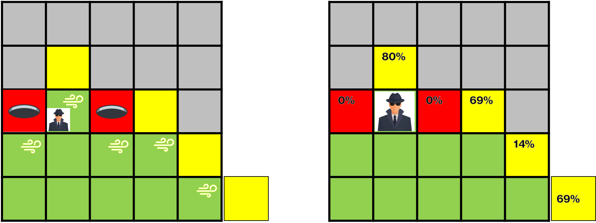

# AI 2021/2022 - Assignment 5
This folder contains the fifth assignment for the Artificial Intelligence course of the MSc. in Computational Data Science of the Free University of Bozen-Bolzano

## Team Members
Ceol Samuele, Fanti Coelho Lima Rachel, Hooshyar Hosna

## Table of Contents
[[_TOC_]]

## First setup
The first step required to run this assignment is to create the appropriate Conda environment.
To do so, open the command line, move to the source directory of this project (where the environment.yml file is contained) and run the command:

`conda env create --file environment.yml`

## Running the assignment (random world)
Once the environment has been created, activate it by running:

`conda activate aima2021`

Then, move to the wumpus-online folder (`cd wumpus-online`) where the code for this second assignment is contained.
An example on how the game can be executed with the implemented `CustomPlayer` with a given `truth_threshold` both on a randomly generated world and on a static world created from a JSON variable can be found in the `run_OnlinePlayer.ipynb` file.

## Tasks
Your task is to create a player (a subclass of `wumpus.OnlinePlayer`) able to control the hunter in such a way that it maximise its outcome. The size and layout of the world will be randomly generated but you can make the following assumptions, following the classic game setup:
* the environment is a square
* there is exactly a wumpus
* there is exactly a gold ingot
* the environment doesn’t contain any block
* the hunter is always starting in the bottom left corner facing upward (north)
* there is a single exit placed in the same square where the hunter starts

Note that it’s **not guaranteed** that the gold ingot is always reachable; that is there might be cases in which the gold ingot is not reachable and the strategy to maximise the outcome is to climb out immediately.
Your code **must** be runnable via the `gridrunner`
script which takes as input the reference to the class implementing the player. By default the script adds the current directory to the Python search path (`sys.path`) but an alternative path could be added with the `—path` option. For example the player `wumpus.UserPlayer` could be run using:

`gridrunner —world WumpusWorld —entry wumpus.UserPlayer`

## Code Structure
The code related to this assignment is mostly organised into five different Python files.

In this regard, we can identify two main components containing the core logic:

* `CustomPlayer` class (`custom_player.py`)
* `GameEnvironment` class (`game_env.py`)

And three "single purpose" modules:

* `AStar` class (`a_star_module.py`)
* `SMT_module` class (`smt_module.py`)
* `Bayesian_module` class (`bayesian_module.py`)

### CustomPlayer class

The `CustomPlayer` class is an extension of the `wumpus.OfflinePlayer`. This class contains the logic related to initialising the `GameEnvironment` object utilised during the course of the game and receiving (at each step in the game) the action that the agent needs to perform.

This class contains the following variables:

* `truth_threshold`: Numerical value (between 0 and 1) determining the percentage value above which a response from the Bayesian module for a given location is accepted as ground truth.
* `name`: `Str` variable used as identifier for the agent.

The class contains the following methods:

* `start_episode()`: The method is called at the beginning of each game. In this context, a new `GameEnvironment` object is initialised with the `truth_threshold` passed to the `__init__()` method.
* `play()`: Called at each turn during the game to determine the next action the agent will perform in the ongoing game. This method will call the `get_action()` method of the `GameEnviornment` object to trigger the computation of the next action given the information collected on the game environment and the current `percept`.

### GameEnvironment class

The `GameEnvironment` class has two main purposes: On the one hand, it keeps track of all the environment information that has been collected by the agent during the course of the game. On the other hand, it uses said information to compute the set of actions the agent will need to perform given a certain (known) environment configuration.

This class contains the following variables:

* `START_LOC`: A tuple indicating the starting coordinates of the agent. Set to the value `(0,0)`.
* `agent_loc`: Used to keep track of the agent position throughout the game. Initial value is set as `START_LOC`.
* `agent_orientation`: Used to keep track of the agent orientation throughout the game. Initial value i set to `wumpus.Hunter.Orientation.N`.
* `arrow_used`: A boolean variable indicating whether a kill attempt has already been performed. Initialised as `False`.
* `world_size`: A tuple keeping track of the (currently known) environment size. Initialised as `(1,1)`.
* `size_known`: A boolean variable indicating whether the value stored in `world_size` is fixed (i.e. the true size of the world is known).
* `kill_loc`: Tuple indicating the target location for the kill attempt. Initialised as `None`.
* `ready_to_shoot`: Boolean variable indicating whether the agent has reached the location from which it will attempt shooting the wumpus. Initialised as `False`.
* `head_out`: Boolean variable indicating whether the agent should head towards the start location and leave the game environment. Initialised as `False`.
* `curr_percepts`: List of strings containing the set of percepts the agent is experiencing at the current location. Initialised as `None`.
* `pending_locs`: Set containing the locations that are pending to be explored. Initialised as an empty set.
* `free_locs`: Set containing the explored locations that are free of percepts. Initialised as an empty set.
* `stench_locs`: Set containing the explored locations containing a stench. Initialised as an empty set.
* `breeze_locs`: Set containing the explored locations containing a breeze. Initialised as an empty set.
* `wumpus_locs`: List containing the fringe locations that could potentially contain a Wumpus.
* `pits_locs`: List containing the fringe locations that could potentially contain a pit
* `action_list`: List containing the set of actions that will be passed to the agent.
* `truth_threshold`: Threshold value required for a result of the bayesian module to be interpreted as ground truth.

The `GameEnvironment` methods are organised as follows:

* `get_action()`: This method is called at the beginning of each turn. Firstly, it will call the `update_env()`  method to actualise the `GameEnvironment` variables based on the most current percepts. Secondly, it will check if the `action_list` is currently empty. If that is the case, the `build_action_list()` method is called and a new set of actions is computed for the agent. Otherwise, the first action from the list is extracted, the method `execute_action()` is called to update the agent position and orientation and the action is returned to the `play()` method of the `CustomPlayer` class.
* `update_env()`: Triggers the update of the tile related lists by calling the `update_tile_lists()` method. Additionally, it ensures the the size of the world is actualised by calling the `update_world_size()` method. If the current location is newly discovered or the world size has been updated or fixed, it calls also calls the `compute_models()` method of the `SMT_module` class in order to update the `wumpus_locs` and `pits_locs` lists.
* `build_action_list()`: This methods generates the list containing the set of actions the agent will need to perform. Before starting this process, the list of pending locations is updated by calling the `update_pending_locs()` method.  Then, the action list is built:
	* As a first step, the method will check if the agent is sensing glitter (`wumpus.Percept.GLITTER`) or if the variable `head_out` is set to `True`. In this case, the method will return the set of action (provided by the `run_AStar()` method of the `AStar` module) needed to get back to the start location and climb out.
	* If at least one of the previous conditions is not met, the system will verify whether there are some values in the `pending_locs` list. If that is the case, pending locations directly neighbouring the current agent location are prioritised and the set of pivoting and move actions required to reach them is computed by calling the `execute_direction()` method. Otherwise, the `AStar` class is called to compute the shortest path required to reach the pending location closest to the agent.
	* In case of an empty pending location list, the system will check if a kill attempt can be performed. In this context, if at least one stench location has been found and the arrow is yet to be used (`arrow_used` is `False`) the method `attempt_kill()` is called in order to build the list of action required to execute the kill attempt.
* `update_pending_locs()`: This method updates the set of stored pending locations. In particular, said list is updated as follows:
	* If present, the current agent location is removed from the `pending_locs` list.
	* Locations that have been flagged as potentially containing a Wumpus (`wumpus_locs`) or a Pit (`pit_locs`) by the SMT module are filtered out.
	* Locations that have been removed from the set of Wumpus (`wumpus_locs`) and Pit (`pit_locs`) candidates are added back into the `pending_locs` list.
	* Locations that are outside the known world boundaries are filtered out.
If the list of pending locations still appears empty and a kill attempt is not possible or has already been performed,  the `Bayesian_module` is called through the `get_bayes_loc()` method.
* `get_bayes_loc()`: This method calls the `Bayesian_module` to obtain the pit and wumpus probabilities for the known fringe locations. The `model` parameter determines whether potential pits (`Model.PIT`) or Wumpus (`Model.WUMPUS`) locations are evaluated. The `checked_likelihood` parameters determines whether the probability of a location being free (`checked_likelihood` is `False`) or occupied (`checked_likelihood` is `True`) is computed.
* `update_tile_lists()`: Updates the value for the current percept (`curr_percept`) and the list of known stench (`stench_locs`), breeze (`breeze_locs`) and free (`free_locs`) tiles. If a `wumpus.Percept.SCREAM` is felt, the previously discovered stench locations are removed from `stench_locs` and the set of stench location without breeze is set as free.
* `update_world_size()`: Updates the known world size (`world_size`) if the current agent location exceeds the previously assumed boundaries in at least one of the two coordinates values. If a `wumpus.Percept.BUMP` is among the current percepts, the world size is fixed (`size_known` is set to `True`).
* `get_viable_directions()`: Given the current location of the agent, returns the (sub)set of directions that are not blocked by the environment boundaries, breeze or stench tiles. If at least one pending location is directly reachable from the current agent location, only the directions leading to said targets are returned.
* `execute_direction()`: Computes the rotation and move operations needed for the agent to travel to a given direction (N,E,S,W). Return the list of actions to be executed by the agent.
* `execute_action()`: Updates the appropriate environment variables based on the pivot, move, or shoot action passed as a parameter.
* `attempt_kill()`: Computes the set of actions required to attempt a kill on the Wumpus. If only a single candidate is contained in the `wumpus_locs` list, the candidate is set as the chosen kill location (`kill_loc`). If more than one candidate is available, the `Bayesian_module` is called to compute the candidate with the highest probability of containing a Wumpus. After the candidate selection process is over, the kill attempt will proceed following two steps:
	* Firstly, the path to the closest stench tile is computed by the `AStar` module and the set of actions that are part of the path are passed to the agent. At this step, the `ready_to_shoot` variable is set to `True`.
	* Once the path to the stench location has been consumed (and given that `ready_to_shoot` is `True`). The `attempt_kill()` method will return the required pivots (plus the `wumpus.Hunter.Actions.SHOOT`) needed to complete the killing process.

### AStar module

This module is a port of the A-Star implementation proposed in Assignment 3. It uses the Manhattan distance + Manhattan pivots as the chosen heuristics. The class can be called in order to compute the shortest path between two locations in the environment. Only already explored tiles (and safe fringe tiles) can be part of the usable tiles in the computed paths.

This class contains the following variables:

* `agent_path`: List that stores the set of actions that are part of a computed path. Initialised as an empty list.
* `path_cost`: Total cost of the current `agent_path`. Initialised as `0`.
* `target_location`: Target location of the computed path. If no specific target location is passed to the class, the `START_LOC` variable of the `GameEnvironment` object is used.
* `agent_loc`: Variable used to keep track of the agent location when a given path is computed. Used to avoid modifying the corresponding `GameEnvironment` variable.
* `agent_orientation`: Variable used to keep track of the agent orientation when a given path is computed. Used to avoid modifying the corresponding `GameEnvironment` variable.

The `AStar` methods are organised as follows:
* `run_AStar()`: Runs the A-Star algorithms from agent to target location and return the least expensive path. Details of the implementation work as explained in Assignment 3.
* `reset_game()`: Resets the `agent_loc`, `agent_orientation`, `agent_path` and `path_cost` to the original values.
* `load_path()`: Resets the game (by calling the `reset_game()` method) and executes the set of actions  contained in the path by calling the `execute_action_list()` method.
* `get_heuristic()`: Computes the integer of the heuristic of a given agent position with regards to its target. It uses the `scipy.spatial.distance.citiblock` function to compute the Manhattan distance and calls the `compute_manhattan_pivots()` method to compute the nr of pivots related to the current Manhattan path. If the target location correspond to the `START_LOC`, the cost of the `wumpus.Hunter.Actions.CLIMB` is added to the heuristic.
* `compute_manhattan_pivots()`: Computes the (minimum) number of pivots required when moving from a origin to a target location given a certain starting orientation. Further details can be found in the readme of Assignment 3.
* `compute_relative_dir()`: Given origin and target coordinates, it computes the relative position of the target with regards to the origin.
* `get_viable_directions()`: Returns the set of directions that (from the current agent location) lead to a tile that has been already explored (free_breeze_stench) or that is in among the pending locations.
* `execute_direction()`: Given the current agent location and a cardinal direction, it computes the set of pivot and move actions required to execute the specified direction. Returns a list containing the required actions.
* `execute_action_list()`: Updates the stored `agent_loc` and `agent_orientation` based on the action list passed as parameter.

### SMT module

The SMT module has the purpose of flagging fringe locations that might potentially contain a pit or a Wumpus. Flagged locations are avoided until the `pending_locs` list has not been completely exhausted. Given the existence of the Bayesian module, the output of the SMT module is somewhat redundant (the same potentially dangerous location could be flagged by calling it). Despite this fact, the content of the SMT module links to the work done on Assignment 4 and has been considered relevant enough to be included in this implementation.

This class contains the following variables:
* `world_locs`: A list of tuples containing all the existing world locations given the current knowledge on the world size. If the true size of the world is not yet known when this variable is initialised (i.e. The `size_known` variable of the `GameEnvironment` object is set to `False`), the set of generated world locations in this list will be built for a world that is one tile bigger than the currently known size.
* `pits_locs`: A set containing the locations flagged as potentially containing a pit. Initialised as an empty set.
* `wumpus_locs`: A set containing the locations flagged as potentially containing a Wumpus. Initialised as an empty set.

The class is organised into two methods:
* `compute_models()`: This method initialises the `world_locs`, `pits_locs` and `wumpus_locs` and makes the appropriate calls to the `compute_model()` method in order to populate (and return) the set of potential pit and Wumpus locations. In particular, the list of pits or Wumpus location is computed only if at least one breeze or stench tile respectively has been discovered during the course of the game. Additionally, after the `compute_model()`  has returned the set related to the potential Wumpus location, a further filtering is performed to ensure that all flagged Wumpus fringe locations are neighbouring all discovered stench locations.
* `compute_model()`: Given a model (having value either `Model.WUMPUS` or `Model.PIT`), a `GameEnvironment` object and a set of world locations as input parameters, this method returns the set of fringe locations potentially containing a dangerous element. In the same vein as Assignment 4, this module uses the `Solver` class of the `Z3` Python API which generates a general purpose solver to which a set of constraint are added using the `add()` method. This set of constraints is dynamically built (as a `str` variable) depending on the currently available information on the game environment, in particular:
	* Already explored locations are surely free (e.g. `p10 == 0` and `w10 == 0`)
	* Unexplored locations with all adjacent explored tiles with stench/breeze are potentially occupied (e.g. `Or(p20 == 0, p20 == 1)` and `Or(w20 == 0, w20 == 1)`)
	* Only one Wumpus exists in the game environment (e.g. `w00 + w10 + w20 + w11 + w21 + w31 == 1`)
	* For each stench tile, the set of unexplored neighbours contains one Wumpus (e.g. `w20 + w11 == 1`)
	* For each breeze tile, at least one unexplored neighbour must be a pit, at most all unexplored neighbours are pits (e.g. `And(w20 + w11 >= 1, w20 + w11 <= 2)`)

The asserted constraints are then solved using the `check()` method and the set of satisfiable results (i.e. possible configurations of pit and Wumpus location in the environment) is collected. From this set of satisfiable results, all the location flagged as dangerous are extracted and returned.

### Bayesian module

Similarly to what has been described for the SMT module, the Bayesian module also flags potentially dangerous fringe locations given the current information that has been collected with regards to a given world environment. The key difference is that the probability of a location being free (or occupied) is returned with each flagged entry.

The class contains a single `compute_models()` method. Given a `GameEnvironment` variable, a model name (with value either `Model.WUMPUS` or `Model.PIT`) and a Boolean variable `checked_likelihood` (which determines whether the method returns the probability of a location being free or occupied) as input parameters, this method returns the set of fringe location together with their probability of containing (or not containing depending on the `checked_likelihood` value) a Wumpus or a pit. To build the Bayesian network this method uses functions of the `pgmpy`  package. Apart from some minor changes, the code structure for this method resembles the one contained in the notebook provided as aid for this assignment. As a first step, the conditional probability distribution of world locations containing a dangerous element (`d_cpds`) is computed. For pits, the probability of the item appearing in a given location is `0.2` (with a probability of `0.8` of it not appearing). For the Wumpus, the probability of the item appearing in a given location is `1 / nr. of world locations`. As a second step, the set of cpds for percepts (`p_cpds`) on explored locations is computed. The `BayesianNetwork` object is then initialised and populated starting from the `d_cpds` and `p_cpds` values. A `VariableElimination` object is then initialised from the network and queried for all fringe locations. Depending on the value for the parameter `checked_likelihood` , the probability related to `True` (i.e. a location being occupied) or `False` (i.e. a location being free) is extracted from the return value of the `query()` method called on the `VariableElimination` object. Additionally, if the agent is searching for the probability of a fringe location not containing a pit, only values exceeding the `truth_threshold`  are returned.

## Structure of a game
Looking at the structure of the code, it is easy to understand how any game can be divided (at most) into four phases:

* **Initial (safe) exploration**: In this first phase, the agent explores all the safe locations that the game has to offer from the start location. This fundamentally means that the exploration continues until there are values in the `pending_locs` list. During this phase, the SMT module is called to keep track of the fringe locations that might contain a pit or a Wumpus (and therefore should not be explored). If at any point during this phase the `wumpus.Percept.GLITTER` is felt by the agent, a `wumpus.Hunter.Actions.GRAB`  action is performed and the return to the start location is triggered.
* **(Optional) Kill attempt**: Once the pending location list has been completely exhausted, (when possible) it makes sense for the agent to attempt a kill. In fact, killing the Wumpus might free up new locations that where previously not explorable in a safe manner. Because of this reason, if at least one stench tile has been discovered during the initial exploration, a kill attempt is performed. If (upon verifying that the kill was successful by receiving a `wumpus.Percept.SCREAM`) previously unsafe locations are set as explorable, the initial exploration is resumed.
* **(Optional) Bayesian call**: If the pending location list is empty and a kill attempt has already been performed (or cannot be performed), the Bayesian module is called in order to asses if there are any fringe location with a probability of being safe that is higher than the currently set `truth_threshold`. If that is the case, the agent moves towards the closest location with the highest probability of being safe. It that is not the case, the agent returns to the start location and heads out.
* **Agent death / Return to start**: A game always ends with the agent either dying (after taking a chance with a location that has a certain probability of being dangerous) or heading out. Heading out entails calling the A-Star module to compute the optimal path from the current agent location to the start location and climbing out.

The following animation shows a game composed of: The initial exploration, a kill attempt, a second exploration after the kill attempt and the return to start after grabbing the gold. On the left side it is possible to see how some of the `GameEnvironment` variables are updated during the game (which is visually shown on the right side):

Naturally, some game configurations might require a call to the bayesian module. The following image shows an example of such a configuration, together with the results that would be returned by the bayesian module for each fringe location (right side):

In this context, the agent would head towards tile `(1,3)` if the `truth_threshold` has been set to a value smaller than `0.8`. Otherwise, the agent would simply head out.

## Threshold data
In order to verify how changing the `truth_threshold` affects the final results of the game, some data was collected by experimenting with different combination of world sizes and safety thresholds. In particular, four different thresholds (`0.6`, `0.7`, `0.8` and `0.9`) and five different world sizes (`4x4`,  `5x5`,  `6x6`, `7x7` and  `8x8`) were chosen for this purpose. For each possible combination, a total of `100` experiments were executed. For each experiment, the world layout was randomly generated. The code that was used to run this experiments can be found in `threshold_test.ipynb` and the results have been stored in `threshold_test.json`.

In terms of average final reward, the experiment data looks as follows:

|         | 60% | 70% | 80% | 90% |
|---------|---------|---------|---------|---------|
| 4x4 | 372     | 314     | 287     | 354     |
| 5x5 | 259     | 213     | 272     | 305     |
| 6x6 | 134     | 192     | 193     | 150     |
| 7x7 | -63     | 155     | 113     | 113     |
| 8x8 | 38      | 128     | 132     | 110     |

In terms of percentages of death per configuration, the experiment data looks as follows:

|         | 60% | 70% | 80% | 90% |
|---------|---------|---------|---------|---------|
| 4x4 | 9%      | 1%      | 0%      | 0%      |
| 5x5 | 12%     | 2%      | 0%      | 0%      |
| 6x6 | 17%     | 3%      | 0%      | 0%      |
| 7x7 | 21%     | 4%      | 0%      | 0%      |
| 8x8 | 22%     | 8%      | 0%      | 0%      |

Looking at this data, it is possible to notice how lower safety threshold tends to favour smaller environments. On the other hand, applying the same threshold on bigger worlds translates into substantially lower average final rewards. This results makes sense considering that a bigger (and therefore more complex) world will likely require the agent to take a risk (i.e. call the bayesian module) multiple times during the course of a single game, therefore increasing the likelihood of the agent ending up in a deadly location.

In terms of death percentages, it can be seen how choosing a threshold of `0.8` or `0.9`  will create a situation where the agent never dies. This likely means that, when required to choose between taking a chance on a potentially dangerous fringe location and heading out, with a threshold above `0.8`  the agent will always decide to head out.
